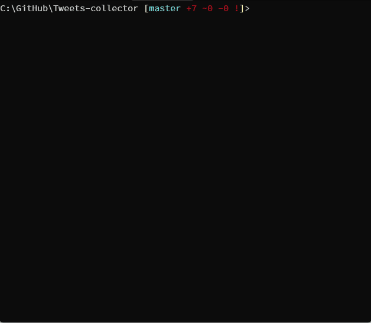

# Tweets-collector

## これは何？

特定のTwitterアカウントのツイート履歴をjsonファイルに保存するスクリプト

## 使い方

1. `yarn install`
1. `cp .env.placeholder .env`
1. `TWITTER_OAUTH2_CLIENT_ID`、`TWITTER_OAUTH2_CLIENT_SECRET`、`CALLBACK_URL`、`PORT`に任意の値をセット
1. `yarn node --loader ts-node/esm index.ts` or `tsc && node ./dist/index.js`

## 例

